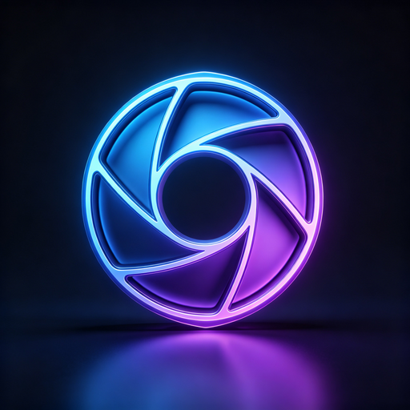
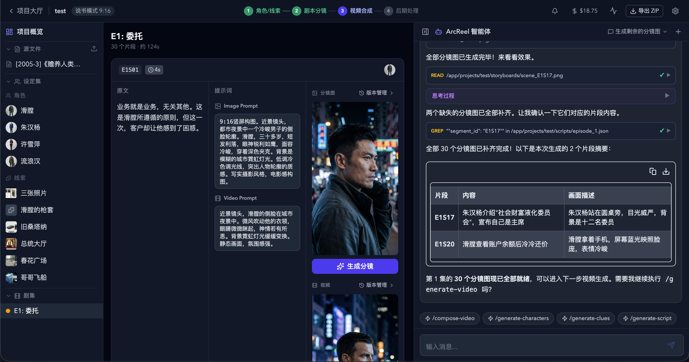
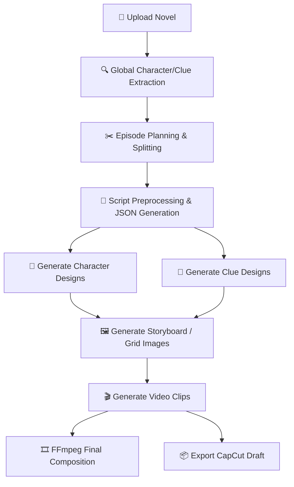
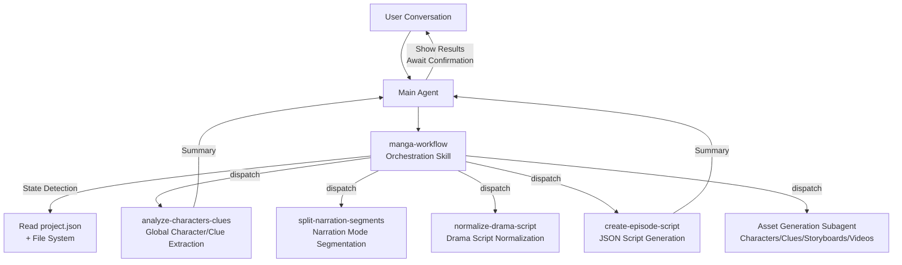
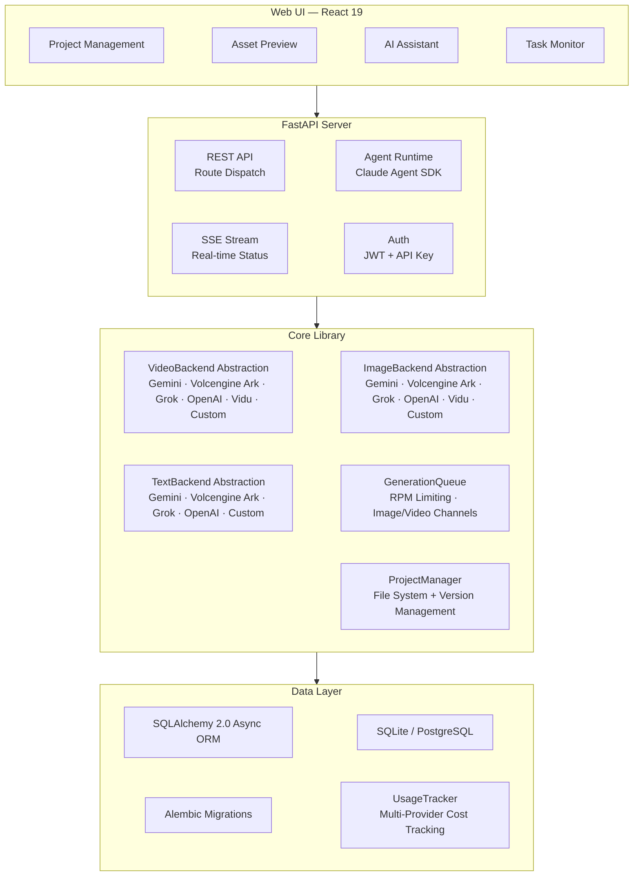

<h1 align="center">
  <br>
  <picture>
    <source media="(prefers-color-scheme: light)" srcset="frontend/public/android-chrome-maskable-512x512.png">
    <source media="(prefers-color-scheme: dark)" srcset="frontend/public/android-chrome-512x512.png">
    
  </picture>
  <br>
  ArcReel
  <br>
</h1>

<h4 align="center">Open-source AI Video Generation Workspace — Novel to Short Video, Powered by AI Agents</h4>

<p align="center">
  <a href="README.md"></a>
  <a href="README.en.md"></a>
</p>

<p align="center">
  <a href="#quick-start"></a>
  <a href="https://github.com/ArcReel/ArcReel/blob/main/LICENSE"></a>
  <a href="https://github.com/ArcReel/ArcReel"></a>
  <a href="https://github.com/ArcReel/ArcReel/pkgs/container/arcreel"></a>
  <a href="https://github.com/ArcReel/ArcReel/actions/workflows/test.yml"></a>
  <a href="https://codecov.io/gh/ArcReel/ArcReel"></a>
  <a href="https://github.com/ArcReel/ArcReel/security/code-scanning"></a>
  <a href="https://github.com/ArcReel/ArcReel/releases/latest"></a>
</p>

<p align="center">
  
  
  
  
  
  
  
  
  
</p>

<p align="center">
  
</p>

---

## Core Features

<table>
<tr>
<td width="20%" align="center">
<h3>🤖 AI Agent Workflow</h3>
Built on the <strong>Claude Agent SDK</strong>, orchestrating Skills + focused Subagents for multi-agent collaboration, automating the full pipeline from screenplay to video synthesis
</td>
<td width="20%" align="center">
<h3>🎨 Multi-Provider Image Generation</h3>
<strong>Gemini</strong>, <strong>Volcengine Ark</strong>, <strong>Grok</strong>, <strong>OpenAI</strong>, <strong>Vidu</strong>, and custom providers. Character design sheets ensure consistency; clue tracking maintains prop/scene continuity across shots
</td>
<td width="20%" align="center">
<h3>🎬 Multi-Provider Video Generation</h3>
<strong>Veo 3.1</strong>, <strong>Seedance</strong>, <strong>Grok</strong>, <strong>Sora 2</strong>, <strong>Vidu Q3</strong>, and custom providers, switchable at global or project level
</td>
<td width="20%" align="center">
<h3>⚡ Async Task Queue</h3>
RPM rate limiting + independent Image/Video concurrency channels, lease-based scheduling with checkpoint resume
</td>
<td width="20%" align="center">
<h3>🖥️ Visual Workspace</h3>
Web UI for project management, asset preview, version rollback, real-time SSE task tracking, and built-in AI assistant
</td>
</tr>
</table>

## Workflow



## Quick Start

> ⚠️ **OS**: Linux / macOS / WSL2 / Docker recommended. Native Windows can run project creation and basic flows, but POSIX-only isolation (Bash sandbox, bwrap) auto-degrades. For production, WSL2 or Docker Desktop is still recommended

### Default Deployment (SQLite)

```bash
git clone https://github.com/ArcReel/ArcReel.git
cd ArcReel/deploy
cp .env.example .env
docker compose up -d
# Visit http://localhost:1241
```

### Production Deployment (PostgreSQL)

```bash
cd ArcReel/deploy/production
cp .env.example .env    # Set POSTGRES_PASSWORD
docker compose up -d
```

After first launch, log in with the default account (username `admin`, password set via `AUTH_PASSWORD` in `.env`; if not set, it will be auto-generated and written back to `.env` on first startup). Then go to **Settings** (`/settings`) to complete configuration:

1. **ArcReel Agent** — Configure provider credentials that power the AI assistant. Supports Anthropic and compatible providers, with custom Base URL and model
2. **AI Image/Video/Text Generation** — Configure at least one provider's API Key (Gemini / Volcengine Ark / Grok / OpenAI / Vidu), or add a custom provider

> 📖 For detailed steps, see the [Getting Started Guide](docs/getting-started.md)

## Feature Highlights

- **Complete Production Pipeline** — Novel → Screenplay → Character Design → Storyboard Images → Video Clips → Final Cut, one-click orchestration
- **Multi-Agent Architecture** — Orchestration Skill detects project state and auto-dispatches focused Subagents; each Subagent completes one task and returns a summary
- **Sandboxed Agent Runtime** — Agent tool calls run inside a bwrap sandbox by default; filesystem, network, and subprocess capabilities are allow-listed. Auto-enabled on Linux/macOS; gracefully degrades when native Windows lacks sandbox support
- **Multi-Provider Support** — Image/Video/Text generation all support Gemini, Volcengine Ark, Grok, OpenAI, and Vidu as built-in providers, switchable at global or project level; the AI assistant credentials also support multi-provider configuration
- **Custom Providers** — Connect any OpenAI-compatible or Google-compatible API (e.g., Ollama, vLLM, third-party proxies); auto-discovers available models and assigns media types, with full feature parity with built-in providers
- **Two Content Modes** — Narration mode splits by reading rhythm; Drama mode organizes by scene/dialogue structure
- **Three Video Generation Modes** — Image-to-video (driven by storyboard) / Grid-to-video (compose grid_4/6/9, split cells as first/last frames) / Reference-to-video (generate directly from character/scene/prop asset images, skipping the storyboard step)
- **Progressive Episode Planning** — Human-AI collaborative splitting of long novels: peek probe → Agent suggests breakpoints → user confirms → physical split, produce on demand
- **Style Reference Images** — Upload style references; AI auto-analyzes and applies uniformly to all image generation for visual consistency
- **Character Consistency** — AI generates character design sheets first; all subsequent storyboards and videos reference these designs
- **Clue Tracking** — Key props and scene elements marked as "clues" maintain visual continuity across shots
- **Version History** — Every regeneration auto-saves a version; one-click rollback supported
- **Multi-Provider Cost Tracking** — Image/Video/Text costs all tracked, with per-provider billing strategies and separate currency accounting
- **Cost Estimation** — Pre-generation cost estimates at project/episode/shot level, with three-level drill-down comparing estimated vs. actual costs
- **CapCut Draft Export** — Export CapCut-compatible draft ZIP per episode, supporting CapCut 5.x / 6+ ([Guide](docs/jianying-export-guide.md))
- **Multi API Key Management** — Configure multiple API Keys per provider with active key switching; supports Google Vertex AI credential upload
- **Multilingual UI** — Full internationalization for both frontend and backend
- **Project Import/Export** — Archive entire projects for backup and migration

## Provider Support

ArcReel supports multiple built-in and custom providers through unified `ImageBackend` / `VideoBackend` / `TextBackend` protocols, switchable at global or project level:

### Image Providers

| Provider | Available Models | Capabilities | Billing |
|----------|-----------------|--------------|---------|
| **Gemini** (Google) | Nano Banana 2, Nano Banana Pro | Text-to-image, Image-to-image (multi-reference) | Per-resolution lookup (USD) |
| **Volcengine Ark** | Seedream 5.0, Seedream 5.0 Lite, Seedream 4.5, Seedream 4.0 | Text-to-image, Image-to-image | Per-image (CNY) |
| **Grok** (xAI) | Grok Imagine Image, Grok Imagine Image Pro | Text-to-image, Image-to-image | Per-image (USD) |
| **OpenAI** | GPT Image 2, GPT Image 1.5, GPT Image 1 Mini | Text-to-image, Image-to-image (multi-reference) | Per-token usage (USD) |
| **Vidu** (Shengshu) | Vidu Q2 Image, Vidu Q1 Image | Text-to-image, Image-to-image | Credits-based (CNY) |

### Video Providers

| Provider | Available Models | Capabilities | Duration (s) | Billing |
|----------|-----------------|--------------|--------------|---------|
| **Gemini** (Google) | Veo 3.1, Veo 3.1 Fast, Veo 3.1 Lite | Text-to-video, Image-to-video, Video extension, Negative prompts | 4 / 6 / 8 | Per-resolution × duration lookup (USD) |
| **Volcengine Ark** | Seedance 2.0, Seedance 2.0 Fast, Seedance 1.5 Pro | Text-to-video, Image-to-video, Video extension, Audio generation, Seed control, Offline inference | 4–15 | Per-token usage (CNY) |
| **Grok** (xAI) | Grok Imagine Video | Text-to-video, Image-to-video | 1–15 | Per-second (USD) |
| **OpenAI** | Sora 2, Sora 2 Pro | Text-to-video, Image-to-video | 4 / 8 / 12 | Per-second (USD) |
| **Vidu** (Shengshu) | Vidu Q3 Turbo, Vidu Q3 Pro, Vidu Q3 (Reference), Vidu 2.0 | Text-to-video, Image-to-video, Reference-to-video, Audio generation, Seed control | 1–16 (Reference-to-video 3–16; 2.0: 4 / 8) | Credits-based (CNY) |

### Text Providers

| Provider | Available Models | Capabilities | Billing |
|----------|-----------------|--------------|---------|
| **Gemini** (Google) | Gemini 3.1 Pro, Gemini 3 Flash, Gemini 3.1 Flash Lite | Text generation, Structured output, Visual understanding | Per-token usage (USD) |
| **Volcengine Ark** | Doubao Seed 2.0 Pro / Lite / Mini, Doubao Seed 1.8 | Text generation, Structured output, Visual understanding | Per-token usage (CNY) |
| **Grok** (xAI) | Grok 4.20 Reasoning / Non-Reasoning, Grok 4.1 Fast Reasoning / Non-Reasoning | Text generation, Structured output, Visual understanding | Per-token usage (USD) |
| **OpenAI** | GPT-5.5, GPT-5.4, GPT-5.4 Mini, GPT-5.4 Nano | Text generation, Structured output, Visual understanding | Per-token usage (USD) |

### Custom Providers

In addition to built-in providers, you can connect any **OpenAI-compatible** or **Google-compatible** API:

- Add a custom provider in the Settings page with Base URL and API Key
- Auto-discovers available models via `/v1/models`, infers media types (image/video/text) by model name
- Full feature parity with built-in providers: global/project-level switching, cost tracking, version management

Provider selection priority: Project-level settings > Global defaults. When switching providers, common settings (resolution, aspect ratio, audio, etc.) carry over; provider-specific parameters are preserved.

## AI Assistant Architecture

ArcReel's AI assistant is built on the Claude Agent SDK, using an **Orchestration Skill + Focused Subagent** multi-agent architecture:



**Core Design Principles**:

- **Orchestration Skill (manga-workflow)** — Has state detection capability, automatically determines the current project phase (character design / episode planning / preprocessing / script generation / asset generation), dispatches the corresponding Subagent, supports entry from any phase and interrupt recovery
- **Focused Subagents** — Each Subagent completes a single task before returning; large context like novel text stays within the Subagent, while the Main Agent only receives concise summaries, protecting context space
- **Skill vs Subagent Boundary** — Skills handle deterministic script execution (API calls, file generation); Subagents handle tasks requiring reasoning and analysis (character extraction, script normalization)
- **Inter-Phase Confirmation** — After each Subagent returns, the Main Agent shows the user a result summary and waits for confirmation before proceeding to the next phase

## OpenClaw Integration

ArcReel supports invocation through external AI Agent platforms like [OpenClaw](https://openclaw.ai), enabling natural language-driven video creation:

1. Generate an API Key in ArcReel's Settings page (`arc-` prefix)
2. Load ArcReel's Skill definition in OpenClaw (access `http://your-domain/skill.md` to auto-fetch)
3. Create projects, generate scripts, and produce videos through OpenClaw conversations

Technical implementation: API Key authentication (Bearer Token) + synchronous Agent chat endpoint (`POST /api/v1/agent/chat`), internally connects to SSE streaming assistant and collects complete responses.

## Technical Architecture



## Tech Stack

| Layer | Technology |
|-------|-----------|
| **Frontend** | React 19, TypeScript, Tailwind CSS 4, wouter, zustand, Framer Motion, Vite |
| **Backend** | FastAPI, Python 3.12+, uvicorn, Pydantic 2 |
| **AI Agents** | Claude Agent SDK (Skill + Subagent multi-agent architecture) |
| **Image Generation** | Gemini (`google-genai`), Volcengine Ark (`volcengine-python-sdk[ark]`), Grok (`xai-sdk`), OpenAI (`openai`), Vidu (`httpx`) |
| **Video Generation** | Gemini Veo 3.1 (`google-genai`), Volcengine Ark Seedance 2.0/1.5 (`volcengine-python-sdk[ark]`), Grok (`xai-sdk`), OpenAI Sora 2 (`openai`), Vidu Q3 (`httpx`) |
| **Text Generation** | Gemini (`google-genai`), Volcengine Ark (`volcengine-python-sdk[ark]`), Grok (`xai-sdk`), OpenAI (`openai`), Instructor (structured output fallback) |
| **Media Processing** | FFmpeg, Pillow |
| **ORM & Database** | SQLAlchemy 2.0 (async), Alembic, aiosqlite, asyncpg — SQLite (default) / PostgreSQL (production) |
| **Authentication** | JWT (`pyjwt`), API Key (SHA-256 hash), Argon2 password hashing (`pwdlib`) |
| **Deployment** | Docker, Docker Compose (`deploy/` default, `deploy/production/` with PostgreSQL) |

## Documentation

- 📖 [Getting Started Guide](docs/getting-started.md) — Step-by-step setup tutorial
- 📦 [CapCut Draft Export Guide](docs/jianying-export-guide.md) — Import video clips into CapCut desktop for further editing
- 💰 [Google GenAI Pricing](docs/google-genai-docs/Google视频&图片生成费用参考.md) — Gemini image / Veo video generation pricing reference
- 💰 [Volcengine Ark Pricing](docs/ark-docs/火山方舟费用参考.md) — Volcengine Ark video / image / text model pricing reference

## Contributing

Contributions, bug reports, and feature suggestions are welcome!

### Local Development

```bash
# Prerequisites: Python 3.12+, Node.js 20+, uv, pnpm, ffmpeg

# Install dependencies
uv sync
cd frontend && pnpm install && cd ..

# Initialize database
uv run alembic upgrade head

# Start backend (Terminal 1)
# Note: --reload-dir is required. Without it, watchfiles scans the entire
# project tree (node_modules / .venv / .git / .worktrees, 150k+ files),
# pinning a CPU core at 50%+.
uv run uvicorn server.app:app --reload --reload-dir server --reload-dir lib --port 1241

# Start frontend (Terminal 2)
cd frontend && pnpm dev

# Visit http://localhost:5173
```

### Running Tests

```bash
# Backend tests
python -m pytest

# Frontend type check + tests
cd frontend && pnpm check
```

## License

[AGPL-3.0](LICENSE)

---

<p align="center">
  If you find this project useful, please give it a ⭐ Star!
</p>
