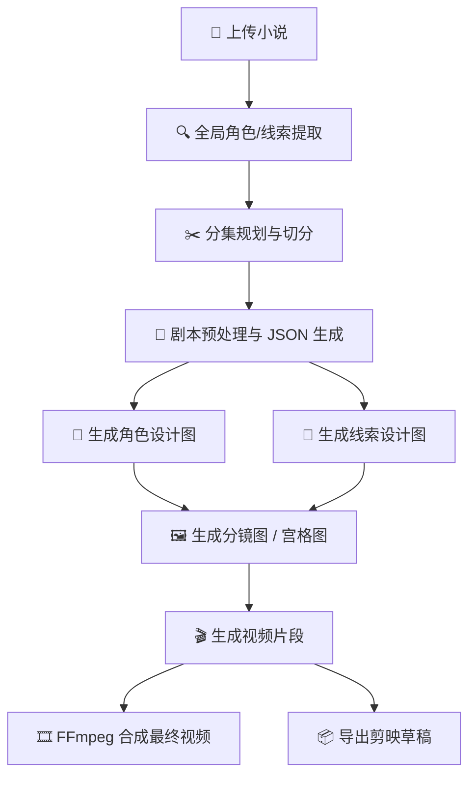
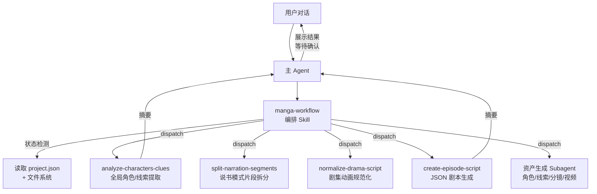
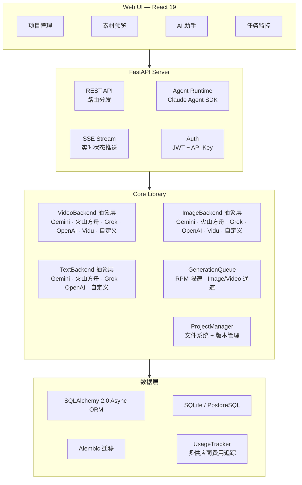

<h1 align="center">
  <br>
  <picture>
    <source media="(prefers-color-scheme: light)" srcset="frontend/public/android-chrome-maskable-512x512.png">
    <source media="(prefers-color-scheme: dark)" srcset="frontend/public/android-chrome-512x512.png">
    
  </picture>
  <br>
  ArcReel
  <br>
</h1>

<h4 align="center">开源 AI 视频生成工作台 — 从小说到短视频，全程 AI Agent 驱动</h4>

<p align="center">
  <a href="README.md"></a>
  <a href="README.en.md"></a>
</p>

<p align="center">
  <a href="#快速开始"></a>
  <a href="https://github.com/ArcReel/ArcReel/blob/main/LICENSE"></a>
  <a href="https://github.com/ArcReel/ArcReel"></a>
  <a href="https://github.com/ArcReel/ArcReel/pkgs/container/arcreel"></a>
  <a href="https://github.com/ArcReel/ArcReel/actions/workflows/test.yml"></a>
  <a href="https://codecov.io/gh/ArcReel/ArcReel"></a>
  <a href="https://github.com/ArcReel/ArcReel/security/code-scanning"></a>
  <a href="https://github.com/ArcReel/ArcReel/releases/latest"></a>
</p>

<p align="center">
  
  
  
  
  
  
  
  
  
</p>

<p align="center">
  
</p>

---

## 核心能力

<table>
<tr>
<td width="20%" align="center">
<h3>🤖 AI Agent 工作流</h3>
基于 <strong>Claude Agent SDK</strong>，编排 Skill + 聚焦 Subagent 多智能体协作，自动完成从剧本创作到视频合成的完整流水线
</td>
<td width="20%" align="center">
<h3>🎨 多供应商图像生成</h3>
<strong>Gemini</strong>、<strong>火山方舟</strong>、<strong>Grok</strong>、<strong>OpenAI</strong>、<strong>Vidu</strong> 及自定义供应商，角色设计图确保角色一致性，线索追踪保证道具/场景跨镜连贯
</td>
<td width="20%" align="center">
<h3>🎬 多供应商视频生成</h3>
<strong>Veo 3.1</strong>、<strong>Seedance</strong>、<strong>Grok</strong>、<strong>Sora 2</strong>、<strong>Vidu Q3</strong> 及自定义供应商，全局/项目级可切换
</td>
<td width="20%" align="center">
<h3>⚡ 异步任务队列</h3>
RPM 速率限制 + Image/Video 独立并发通道，lease-based 调度，支持断点续传
</td>
<td width="20%" align="center">
<h3>🖥️ 可视化工作台</h3>
Web UI 管理项目、预览素材、版本回滚、实时 SSE 任务追踪，内置 AI 助手
</td>
</tr>
</table>

## 工作流程



## 快速开始

> ⚠️ **操作系统**：推荐 Linux / macOS / WSL2 / Docker。Windows 原生可运行项目创建与基础流程，但 Bash 沙箱、bwrap 等 POSIX-only 隔离机制会自动降级，生产部署仍建议 WSL2 或 Docker Desktop

### 默认部署（SQLite）

```bash
git clone https://github.com/ArcReel/ArcReel.git
cd ArcReel/deploy
cp .env.example .env
docker compose up -d
# 访问 http://localhost:1241
```

### 生产部署（PostgreSQL）

```bash
cd ArcReel/deploy/production
cp .env.example .env    # 需设置 POSTGRES_PASSWORD
docker compose up -d
```

首次启动后，使用默认账号登录（用户名 `admin`，密码在 `.env` 中通过 `AUTH_PASSWORD` 设置；未设置则首次启动时自动生成并回写到 `.env`），前往 **设置页**（`/settings`）完成配置：

1. **ArcReel 智能体** — 配置驱动 AI 助手的供应商凭据，支持 Anthropic 官方及多种兼容供应商，自定义 Base URL 与模型
2. **AI 生图/生视频/生文本** — 配置至少一个供应商的 API Key（Gemini / 火山方舟 / Grok / OpenAI / Vidu），或添加自定义供应商

> 📖 详细步骤请参考 [完整入门教程](docs/getting-started.md)

## 功能特性

- **完整生产流水线** — 小说 → 剧本 → 角色设计 → 分镜图片 → 视频片段 → 成片，一键编排
- **多智能体架构** — 编排 Skill 检测项目状态并自动调度聚焦 Subagent，每个 Subagent 独立完成一项任务后返回摘要
- **沙箱化 Agent 运行环境** — Agent 工具调用默认运行在 bwrap 沙箱内，文件系统、网络、子进程能力按白名单授权；Linux/macOS 自动启用，Windows 原生不支持沙箱时自动降级
- **多供应商支持** — 图片/视频/文本生成均支持 Gemini、火山方舟、Grok、OpenAI、Vidu 五大预置供应商，全局/项目级可切换；AI 助手凭据同样支持多供应商配置
- **自定义供应商** — 接入任何 OpenAI 兼容 / Google 兼容 API（如 Ollama、vLLM、第三方中转），自动发现可用模型并分配媒体类型，与预置供应商享有同等功能
- **两种内容模式** — 说书模式（narration）按朗读节奏拆分片段，剧集动画模式（drama）按场景/对话结构组织
- **三种视频生成模式** — 图生视频（分镜图驱动）/ 宫格生视频（多分镜合成 grid_4/6/9，拆分作首尾帧）/ 参考生视频（直接以角色/场景/道具资产图生成视频，跳过分镜步骤）
- **渐进式分集规划** — 人机协作切分长篇小说：peek 探测 → Agent 建议断点 → 用户确认 → 物理切分，按需制作
- **风格参考图** — 上传风格图，AI 自动分析并统一应用到所有图片生成，确保全项目视觉一致
- **角色一致性** — AI 先生成角色设计图，后续所有分镜和视频均参考该设计
- **线索追踪** — 关键道具、场景元素标记为"线索"，跨镜头保持视觉连贯
- **版本历史** — 每次重新生成自动保存历史版本，支持一键回滚
- **多供应商费用追踪** — 图片/视频/文本全部纳入费用计算，按供应商分策略计费，不同币种分别统计
- **费用预估** — 生成前预估项目/单集/单镜头费用，三级下钻展示预估与实际费用对比
- **剪映草稿导出** — 按集导出剪映草稿 ZIP，支持剪映 5.x / 6+（[操作指南](docs/jianying-export-guide.md)）
- **多 API Key 管理** — 每个供应商支持配置多个 API Key 并切换激活，支持 Google Vertex AI 凭证上传
- **多语言界面** — 前后端全面国际化，支持多语言切换
- **项目导入/导出** — 整个项目打包归档，方便备份和迁移

## 供应商支持

ArcReel 通过统一的 `ImageBackend` / `VideoBackend` / `TextBackend` 协议，支持多个预置供应商和自定义供应商，可在全局或项目级别切换：

### 图片供应商

| 供应商 | 可用模型 | 能力 | 计费方式 |
|--------|----------|------|----------|
| **Gemini** (Google) | Nano Banana 2, Nano Banana Pro | 文生图、图生图（多参考图） | 按分辨率查表 (USD) |
| **火山方舟** | Seedream 5.0, Seedream 5.0 Lite, Seedream 4.5, Seedream 4.0 | 文生图、图生图 | 按张计费 (CNY) |
| **Grok** (xAI) | Grok Imagine Image, Grok Imagine Image Pro | 文生图、图生图 | 按张计费 (USD) |
| **OpenAI** | GPT Image 2, GPT Image 1.5, GPT Image 1 Mini | 文生图、图生图（多参考图） | 按 token 用量 (USD) |
| **Vidu** (生数科技) | Vidu Q2 Image, Vidu Q1 Image | 文生图、图生图 | 按积分折算 (CNY) |

### 视频供应商

| 供应商 | 可用模型 | 能力 | 时长 (秒) | 计费方式 |
|--------|----------|------|-----------|----------|
| **Gemini** (Google) | Veo 3.1, Veo 3.1 Fast, Veo 3.1 Lite | 文生视频、图生视频、视频延展、负面提示词 | 4 / 6 / 8 | 按分辨率 × 时长查表 (USD) |
| **火山方舟** | Seedance 2.0, Seedance 2.0 Fast, Seedance 1.5 Pro | 文生视频、图生视频、视频延展、音频生成、种子控制、离线推理 | 4–15 | 按 token 用量 (CNY) |
| **Grok** (xAI) | Grok Imagine Video | 文生视频、图生视频 | 1–15 | 按秒计费 (USD) |
| **OpenAI** | Sora 2, Sora 2 Pro | 文生视频、图生视频 | 4 / 8 / 12 | 按秒计费 (USD) |
| **Vidu** (生数科技) | Vidu Q3 Turbo, Vidu Q3 Pro, Vidu Q3 (Reference), Vidu 2.0 | 文生视频、图生视频、参考生视频、音频生成、种子控制 | 1–16（参考生视频 3–16；2.0: 4 / 8） | 按积分折算 (CNY) |

### 文本供应商

| 供应商 | 可用模型 | 能力 | 计费方式 |
|--------|----------|------|----------|
| **Gemini** (Google) | Gemini 3.1 Pro, Gemini 3 Flash, Gemini 3.1 Flash Lite | 文本生成、结构化输出、视觉理解 | 按 token 用量 (USD) |
| **火山方舟** | 豆包 Seed 2.0 Pro / Lite / Mini, 豆包 Seed 1.8 | 文本生成、结构化输出、视觉理解 | 按 token 用量 (CNY) |
| **Grok** (xAI) | Grok 4.20 Reasoning / Non-Reasoning, Grok 4.1 Fast Reasoning / Non-Reasoning | 文本生成、结构化输出、视觉理解 | 按 token 用量 (USD) |
| **OpenAI** | GPT-5.5, GPT-5.4, GPT-5.4 Mini, GPT-5.4 Nano | 文本生成、结构化输出、视觉理解 | 按 token 用量 (USD) |

### 自定义供应商

除预置供应商外，可接入任何 **OpenAI 兼容** 或 **Google 兼容** API：

- 在设置页添加自定义供应商，填入 Base URL 和 API Key
- 自动调用 `/v1/models` 发现可用模型，按名称推断媒体类型（图片/视频/文本）
- 与预置供应商享有同等功能：全局/项目级切换、费用追踪、版本管理

供应商选择优先级：项目级设置 > 全局默认。切换供应商时通用设置（分辨率、宽高比、音频等）直接沿用，供应商特有参数保留。

## 交流群

扫码加入飞书交流群，获取帮助和最新动态：

<p align="center">
  
</p>

## AI 助手架构

ArcReel 的 AI 助手基于 Claude Agent SDK 构建，采用**编排 Skill + 聚焦 Subagent** 的多智能体架构：



**核心设计原则**：

- **编排 Skill（manga-workflow）** — 具备状态检测能力，自动判断项目当前阶段（角色设计 / 分集规划 / 预处理 / 剧本生成 / 资产生成），dispatch 对应的 Subagent，支持从任意阶段进入和中断恢复
- **聚焦 Subagent** — 每个 Subagent 只完成一项任务后返回，小说原文等大量上下文留在 Subagent 内部，主 Agent 只收到精炼摘要，保护上下文空间
- **Skill vs Subagent 边界** — Skill 负责确定性脚本执行（API 调用、文件生成），Subagent 负责需要推理分析的任务（角色提取、剧本规范化）
- **阶段间确认** — 每个 Subagent 返回后，主 Agent 向用户展示结果摘要并等待确认，确认后才进入下一阶段

## OpenClaw 集成

ArcReel 支持通过 [OpenClaw](https://openclaw.ai) 等外部 AI Agent 平台调用，实现自然语言驱动的视频创作：

1. 在 ArcReel 设置页生成 API Key（`arc-` 前缀）
2. 在 OpenClaw 中加载 ArcReel 的 Skill 定义（访问 `http://your-domain/skill.md` 自动获取）
3. 通过 OpenClaw 对话即可创建项目、生成剧本、制作视频

技术实现：API Key 认证（Bearer Token）+ 同步 Agent 对话端点（`POST /api/v1/agent/chat`），内部对接 SSE 流式助手并收集完整响应返回。

## 技术架构



## 技术栈

| 层级 | 技术 |
|------|------|
| **前端** | React 19, TypeScript, Tailwind CSS 4, wouter, zustand, Framer Motion, Vite |
| **后端** | FastAPI, Python 3.12+, uvicorn, Pydantic 2 |
| **AI 智能体** | Claude Agent SDK (Skill + Subagent 多智能体架构) |
| **图像生成** | Gemini (`google-genai`), 火山方舟 (`volcengine-python-sdk[ark]`), Grok (`xai-sdk`), OpenAI (`openai`), Vidu (`httpx`) |
| **视频生成** | Gemini Veo 3.1 (`google-genai`), 火山方舟 Seedance 2.0/1.5 (`volcengine-python-sdk[ark]`), Grok (`xai-sdk`), OpenAI Sora 2 (`openai`), Vidu Q3 (`httpx`) |
| **文本生成** | Gemini (`google-genai`), 火山方舟 (`volcengine-python-sdk[ark]`), Grok (`xai-sdk`), OpenAI (`openai`), Instructor (结构化输出降级) |
| **媒体处理** | FFmpeg, Pillow |
| **ORM & 数据库** | SQLAlchemy 2.0 (async), Alembic, aiosqlite, asyncpg — SQLite (默认) / PostgreSQL (生产) |
| **认证** | JWT (`pyjwt`), API Key (SHA-256 哈希), Argon2 密码哈希 (`pwdlib`) |
| **部署** | Docker, Docker Compose（`deploy/` 默认, `deploy/production/` 含 PostgreSQL） |

## 文档

- 📖 [完整入门教程](docs/getting-started.md) — 从零开始的手把手指南
- 📦 [剪映草稿导出指南](docs/jianying-export-guide.md) — 将视频片段导入剪映桌面版进行二次编辑
- 💰 [Google GenAI 费用说明](docs/google-genai-docs/Google视频&图片生成费用参考.md) — Gemini 图像 / Veo 视频生成费用参考
- 💰 [火山方舟费用说明](docs/ark-docs/火山方舟费用参考.md) — 火山方舟视频 / 图片 / 文本模型费用参考

## 贡献

欢迎贡献代码、报告 Bug 或提出功能建议！请参阅 [贡献指南](CONTRIBUTING.md) 了解本地开发环境搭建、测试和代码规范。

本地克隆后请务必执行一次：

```bash
uv run pre-commit install
```

安装 pre-commit 钩子（ruff check + format、frontend eslint、workflow tripwire），避免把可被自动修复的问题推到 CI。

## 许可证

[AGPL-3.0](LICENSE)

---

<p align="center">
  如果觉得项目有用，请给个 ⭐ Star 支持一下！
</p>